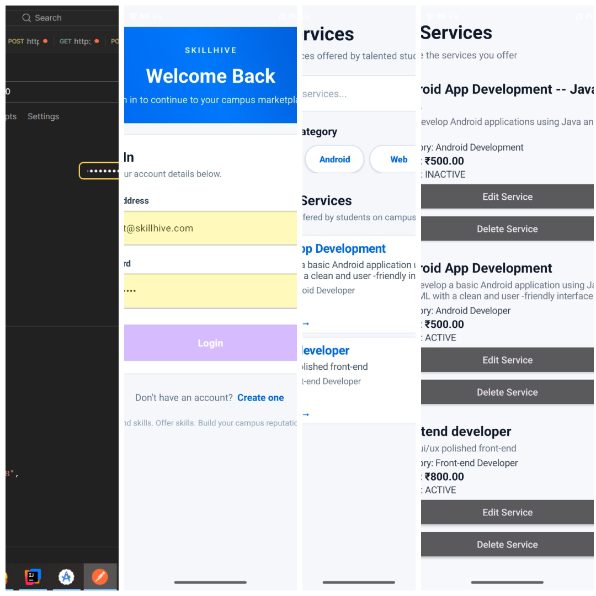
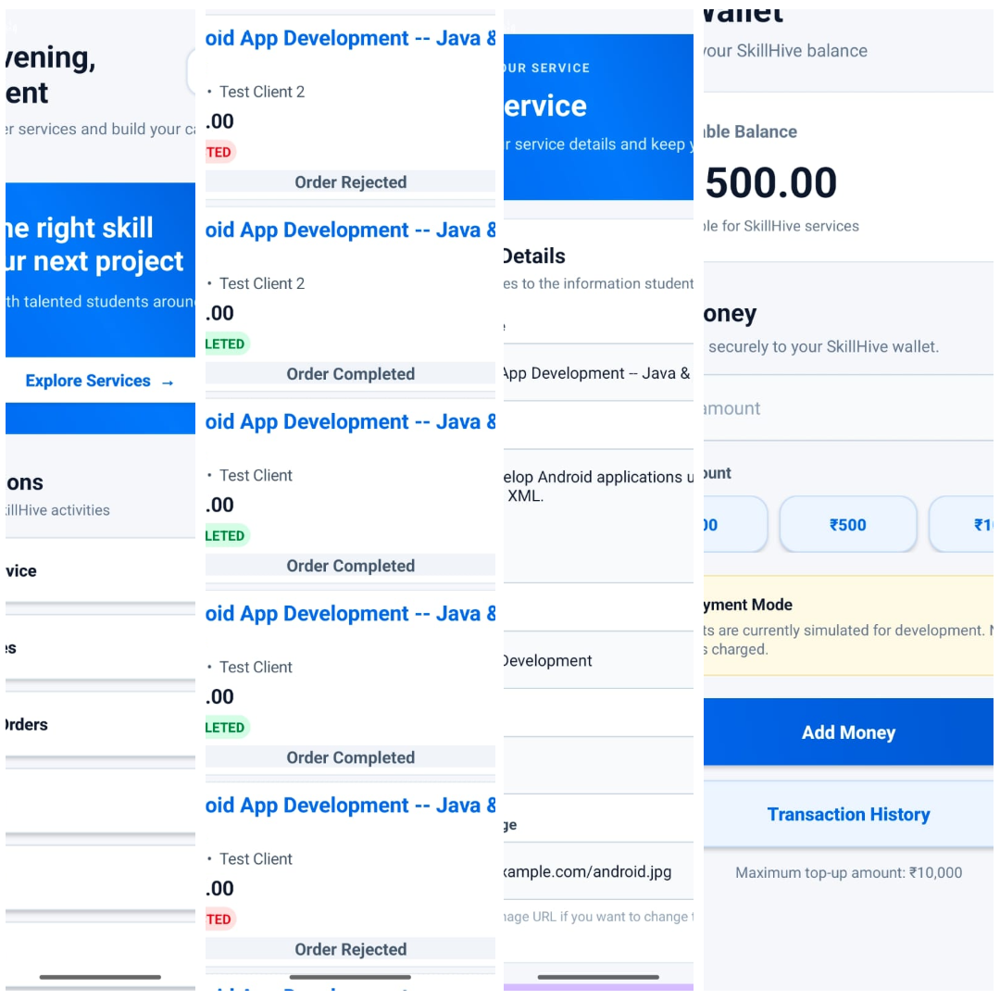
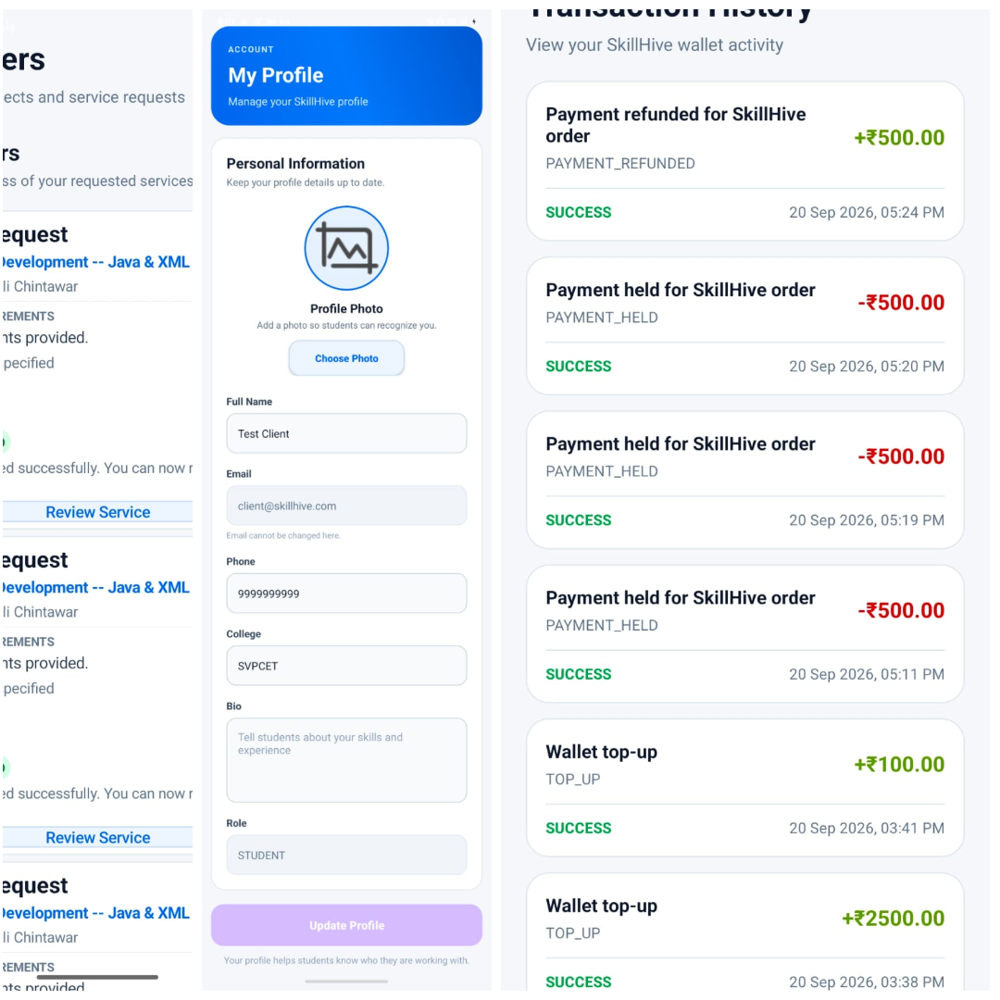

# SkillHive — Campus Freelance Marketplace

> **Find Skills. Offer Skills. Build Your Campus Reputation.**

SkillHive is a campus-focused freelance marketplace that connects students, college clubs, and organizations with students who can provide different digital and technical services.

The platform allows students to **offer services, discover services, place orders, manage payments through a wallet system, communicate through order workflows, and build their campus reputation through reviews and ratings.**

---

## 📱 Application Screenshots

<p align="center">
  
  
  
</p>

---

## 🎯 Problem Statement

Students often have useful technical and creative skills but have limited opportunities to showcase and monetize those skills within their own campus.

At the same time, students and college organizations may need affordable services such as:

* Android app development
* Web development
* Graphic design
* UI/UX design
* Programming assistance
* Other student-provided technical services

SkillHive provides a dedicated campus marketplace for connecting these two groups.

---

## 💡 Solution

SkillHive provides a platform where students can act as both **service providers and clients**.

### Service Providers can:

* Create a profile
* Add their skills
* Publish services
* Set service prices
* Accept or reject orders
* Start and submit work
* Handle revision requests
* Receive payments
* Build reviews and ratings

### Clients can:

* Browse available services
* View service details
* Place orders
* Track order status
* Request revisions
* Complete orders
* Manage wallet balance
* View transaction history
* Review completed services
* Favorite services

---

## ✨ Key Features

### 🔐 Authentication & Security

* User registration and login
* JWT-based authentication
* Role-based authorization
* Protected API endpoints
* Secure password handling

### 👤 User Profiles

* Student profile management
* Name, email, phone and college information
* Skills and experience
* Profile photo support
* Student role management

### 🛠️ Service Marketplace

* Create services
* Browse services
* Service categories
* Service descriptions
* Pricing
* Active/inactive service status
* Edit and delete services

### 📦 Order Management

SkillHive supports a complete order workflow:

```text
Order Created
     ↓
Provider Accepts
     ↓
Work Started
     ↓
Work Submitted
     ↓
Client Reviews
     ↓
Completed
```

Clients can also request revisions before completing an order.

```text
Work Submitted
     ↓
Revision Requested
     ↓
Provider Updates Work
     ↓
Work Submitted Again
```

### 💰 Wallet & Mock Payment System

SkillHive includes a wallet-based payment flow for demonstrating marketplace transactions.

Features include:

* Wallet balance
* Wallet top-up
* Payment hold
* Payment release
* Payment refund
* Transaction history

> **Note:** The current payment system is a mock/simulated payment flow for project demonstration and does not use a real payment gateway.

### ⭐ Reviews & Ratings

After completing a service, clients can provide:

* Rating
* Review
* Service feedback

This helps students build their reputation within the campus marketplace.

### 🔔 Notifications

The system generates notifications for important activities such as:

* New orders
* Order updates
* Accepted/rejected orders
* Work submissions
* Revision requests
* Completed orders
* Payment-related activities

### ❤️ Favorites

Users can save interesting services to their favorites for easier access later.

---

## 📱 Android Application

The client application is developed using **Java and XML in Android Studio**.

### Android Technologies

* Java
* XML
* Android SDK
* Retrofit
* Gson
* OkHttp
* REST APIs

The Android application communicates with the Spring Boot backend through REST APIs.

---

## 🏗️ System Architecture

```text
┌───────────────────────────┐
│      Android App          │
│       Java + XML          │
└─────────────┬─────────────┘
              │
              │ REST API
              ▼
┌───────────────────────────┐
│      Spring Boot          │
│         Backend           │
│                           │
│  Authentication           │
│  Services                 │
│  Orders                   │
│  Wallet                   │
│  Reviews                  │
│  Notifications            │
│  Favorites                │
└─────────────┬─────────────┘
              │
              │ JPA / Hibernate
              ▼
┌───────────────────────────┐
│          MySQL            │
│      SkillHive DB        │
└───────────────────────────┘
```

---

## 🧰 Tech Stack

### Backend

| Technology      | Purpose                        |
| --------------- | ------------------------------ |
| Java            | Backend development            |
| Spring Boot     | REST API development           |
| Spring Security | Authentication & authorization |
| JWT             | Token-based authentication     |
| Spring Data JPA | Database interaction           |
| Hibernate       | ORM                            |
| MySQL           | Database                       |
| Maven           | Build & dependency management  |
| Lombok          | Boilerplate reduction          |

### Android

| Technology     | Purpose                         |
| -------------- | ------------------------------- |
| Java           | Android application development |
| XML            | UI development                  |
| Android Studio | Development environment         |
| Retrofit       | REST API communication          |
| Gson           | JSON serialization              |
| OkHttp         | HTTP networking                 |

---

## 📂 Project Structure

```text
skillhive-backend/
│
├── android-app/
│   ├── app/
│   ├── gradle/
│   ├── build.gradle.kts
│   ├── gradle.properties
│   ├── gradlew
│   ├── gradlew.bat
│   └── settings.gradle.kts
│
├── src/
│   └── main/
│       ├── java/
│       │   └── com/
│       │       └── skillhive/
│       │           └── backend/
│       │
│       └── resources/
│
├── screenshots/
│   ├── skillhive-1.png
│   ├── skillhive-2.png
│   └── skillhive-3.png
│
├── pom.xml
├── Dockerfile
├── mvnw
├── mvnw.cmd
├── .gitignore
└── README.md
```

---

## 🔑 Main REST API Modules

The backend provides REST APIs for:

```text
Authentication
    ├── Register
    └── Login

Users
    ├── Profile
    └── Skills

Services
    ├── Create
    ├── View
    ├── Update
    └── Delete

Orders
    ├── Create
    ├── Accept
    ├── Reject
    ├── Start
    ├── Submit
    ├── Request Revision
    └── Complete

Wallet
    ├── Balance
    ├── Top Up
    └── Transactions

Reviews
    ├── Create
    └── View

Favorites
    ├── Add
    └── Remove

Notifications
    └── View
```

---

## ⚙️ Backend Setup

### 1. Clone the repository

```bash
git clone https://github.com/juelichintawar/skillhive-backend.git
cd skillhive-backend
```

### 2. Create the MySQL database

```sql
CREATE DATABASE skillhive;
```

### 3. Configure database credentials

Update:

```text
src/main/resources/application.properties
```

with your local MySQL username and password.

Example:

```properties
spring.datasource.url=jdbc:mysql://localhost:3306/skillhive
spring.datasource.username=root
spring.datasource.password=YOUR_PASSWORD

spring.jpa.hibernate.ddl-auto=update
spring.jpa.show-sql=true

server.port=8080
```

### 4. Run the backend

Using Maven:

```bash
./mvnw spring-boot:run
```

On Windows:

```bash
mvnw.cmd spring-boot:run
```

The backend runs on:

```text
http://localhost:8080
```

---

## 📱 Android Setup

Open:

```text
android-app/
```

in Android Studio.

Update the Retrofit base URL according to your testing environment.

For a physical Android device using ADB reverse:

```bash
adb reverse tcp:8080 tcp:8080
```

Then the application can communicate with the local Spring Boot backend.

---

## 🔒 Security

SkillHive uses:

* JWT authentication
* Spring Security
* Role-based authorization
* Protected REST endpoints
* Password hashing
* Authenticated API requests

Sensitive local configuration such as passwords and signing files should not be committed to GitHub.

---

## 🧪 Testing

The project was tested through:

* Android application testing
* REST API testing
* Authentication testing
* Service creation and management
* Order lifecycle testing
* Revision workflow testing
* Wallet and transaction testing
* Review and rating testing
* MySQL database verification

---

## 🚀 Future Enhancements

Planned improvements include:

* Real payment gateway integration
* Real-time chat between clients and providers
* Advanced service search and filtering
* Improved recommendation system
* Admin dashboard
* Cloud deployment
* Cloud-based profile images
* Advanced notification system
* Service analytics
* Campus organization accounts

---

## 📚 What I Learned

Through SkillHive, I gained practical experience with:

* Spring Boot REST API development
* Java backend development
* Spring Security and JWT
* MySQL database design
* JPA and Hibernate
* Android development with Java
* Retrofit API integration
* Authentication workflows
* Marketplace/order workflows
* Wallet and transaction management
* Git and GitHub
* Full-stack application architecture

---

## 👨‍💻 Author

**Jueli Chintawar**

B.Tech Computer Science Engineering
St. Vincent Pallotti College of Engineering and Technology

### Technologies

`Java` `Spring Boot` `Android` `MySQL` `REST API` `JWT` `JPA` `Hibernate` `Git` `GitHub`

---

## 📌 Project Highlights

* 🎓 Campus-focused freelance marketplace
* 📱 Android application
* ☕ Java + Spring Boot backend
* 🔐 JWT authentication
* 🛠️ Student service marketplace
* 📦 Complete order workflow
* 💰 Wallet and mock payment flow
* ⭐ Reviews and ratings
* 🔔 Notifications
* ❤️ Favorites
* 🗄️ MySQL database
* 🔗 REST API architecture
